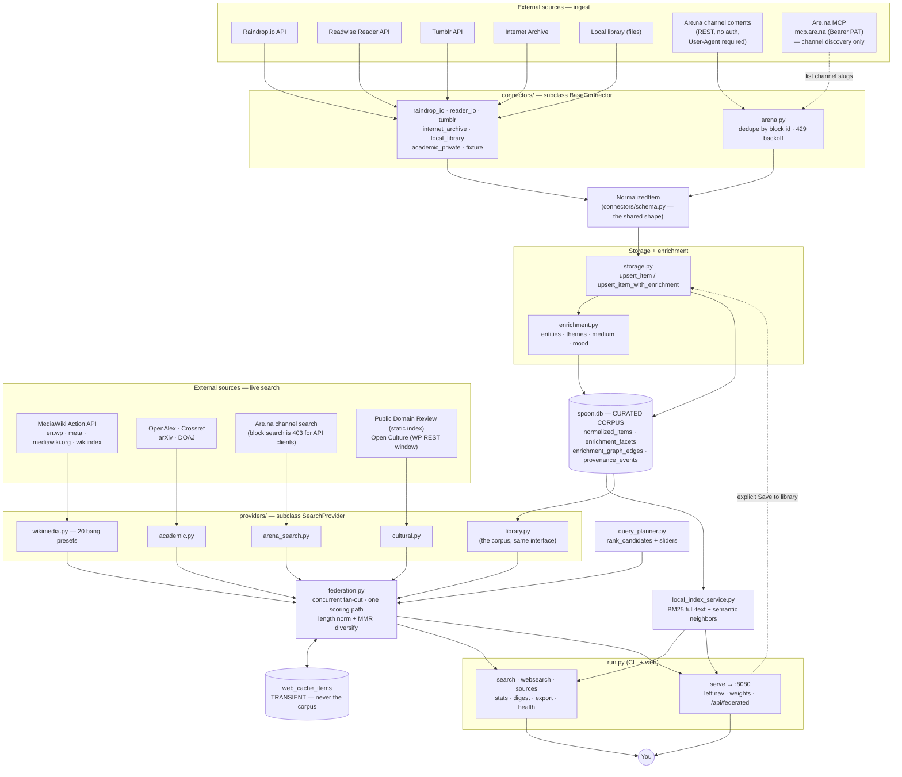

# Architecture — stunning-octo-spoon

High-level data flow. Renders on GitHub and in Obsidian. See
[AGENTS.md](AGENTS.md) for the annotated component list and
[USER_GUIDE.md](USER_GUIDE.md) for how to search.

Two halves meet at `NormalizedItem`: **connectors** ingest into the corpus on a
schedule, **providers** answer a query live. `federation.py` ranks both together.

## Reading the diagram

- **Ingest path:** a source → its connector → `NormalizedItem` → `storage.py`
  (upsert + enrichment) → `spoon.db`.
- **Live path:** a query → the selected providers (concurrently) →
  `NormalizedItem` → `federation.py` → ranked results. Results land in
  `web_cache_items`, **not** in `spoon.db`.
- **The one crossing:** the dashed "explicit Save to library" edge. That is the
  only way a live result becomes a corpus item, which is what keeps the curated
  6,693-item collection curated.
- **The library is also a provider** (`library.py`), which is why local and web
  hits can be scored by identical rules instead of being merged after ranking.
- **Are.na is special:** the MCP discovers *which channels exist* (ingest);
  block contents come over the public REST API. Live search is channel-first
  because Are.na's block-search endpoint returns 403 to API clients. See
  [AGENTS.md §9](AGENTS.md).
- **`query_planner` is finally on a search path** — via `federation.py`. It is
  still not on the older `run.py search` path, which remains library-only.
