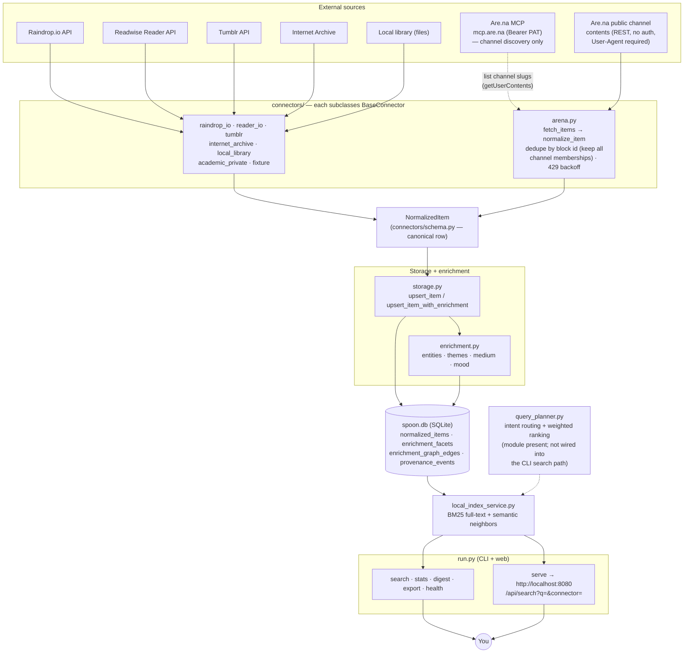

# Architecture — stunning-octo-spoon

High-level data flow. Renders on GitHub and in Obsidian. See
[AGENTS.md](AGENTS.md) for the annotated component list and
[USER_GUIDE.md](USER_GUIDE.md) for how to search.

## Reading the diagram

- **Ingest path (solid):** a source → its connector → `NormalizedItem` →
  `storage.py` (upsert + enrichment) → `spoon.db`.
- **Are.na is special (dashed):** the MCP is used **only to discover which
  channels exist**; the actual block *contents* are pulled over the public REST
  API with no auth. See [AGENTS.md §6](AGENTS.md).
- **Search path:** `spoon.db` → `LocalIndexService` (BM25 + semantic) → the CLI
  and web UI. `query_planner.py` exists as a routing/ranking layer but is not on
  the `run.py search`/`serve` path today (dashed).
- **One canonical DB:** the main clone's `spoon.db` (6,693 items). Backups noted
  in [AGENTS.md §2](AGENTS.md).
